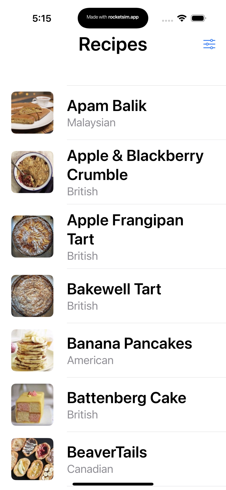
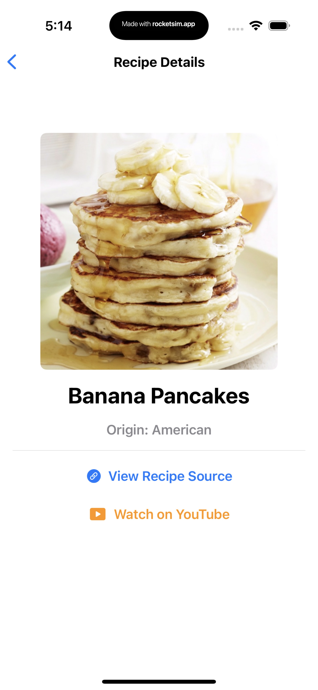
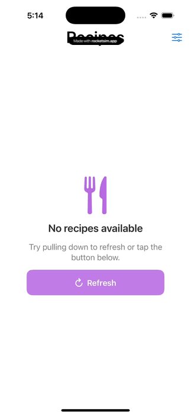
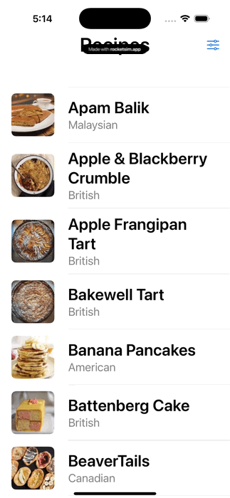
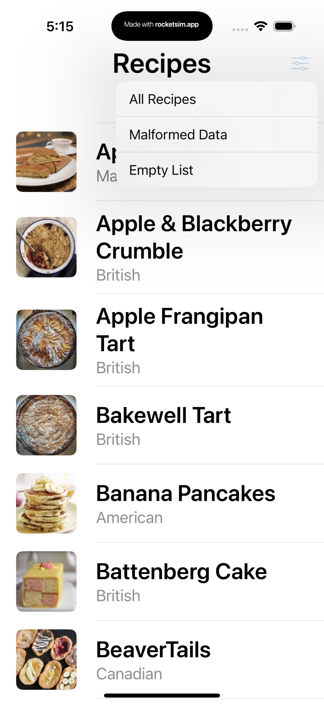

# Fetch Mobile Take Home Project

**Task:** To build a recipe app that displays recipes from the provided API endpoint.

**Description:** What production-ready code looks like for a sample app.

## To help understand the approach and decision-making process: 

### Summary

**Demo Screenshots**

| Description        | Preview                     |
|-----------------|----------------------------|
| All Recipes List    |     |
| Link Demo     |      |
| Recipe Detail View |  |
| Empty List State       |        |
| Error State   |    |
| Debug Menu  |   |

---

### Focus Areas: What specific areas of the project did you prioritize? Why did you choose to focus on these areas?

- I started by planning, this is really helpful because I was able to review the given requirements against other projects I've made for ideas to use
- Design, it was really easy though, SwiftUI makes basic designs easier than ever to make
- The Network Layer, this is a crucial piece of a large majority of apps in the app store and for enterprise use
    - The network layer pieces in this demo app are broken down into parts, but in a real app it would need to have a lot of other tooling built in for serialization/pooling, cancelling requests, authentication, etc.

Why did I choose these areas?

The app requirements were not overly complex or demanding so I think these areas would be focus areas for most submissions. However, planning was really helpful because it would be easy to write a messy and small footprint app that meets the requirements.

### Time Spent: Approximately how long did you spend working on this project? How did you allocate your time?
- 2 hours planning and reviewing requirements, making sample designs, considering approach
- 3 hours building out the app and design
    - Recipe List, Row View, Detail View, and Navigation
    - Image Cache tool which would ideally be more robust in a real app
    - Network client tool which would ideally be more robust in a real app
    - Some refactoring was done throughout
    - Breaking down the network client layer in pieces for modularity
- 1.5 hours writing tests after all logic was written
    - TDD is great, but often impractical unless the requirements are really well defined for the code
- 1 doing writeup for ReadMe and more

### Trade-offs and Decisions: Did you make any significant trade-offs in your approach?

- Error handling is not very robust in this app. To be fair, the API sends static responses and there limited design requirements for error handling such as image download failures, cache loading failures, etc.
- Some force unwraps exist in the project unit tests, this is not ideal because it can be confusing to debug when the app crashes in the pipeline while unit tests are being ran
- Simple and limited designs, the app is a demo and I have a lot to do besides take-home projects so I tried to make it neat and simple, yet nice to look at
- The app is not DRY, in a production app there are various reasons to avoid being DRY, in this case I did it so I wouldn't run into any issues and could move on to the next feature without having to refactor too many methods or classes

### Weakest Part of the Project: What do you think is the weakest part of your project?

- Unit Tests
    - Coverage is not 90%+ for view models
    - Some edge cases are not tested
- Previews
    - Network calls can be made from Previews which is not ideal
    - Real objects like ImageCacheManager can be used which is not ideal
    - It would be best to have a separate target which contains local testing tools such a localhost/debugServer using Vapor or perhaps Mocked dependencies
- Dependency Management
    - Ideally I would use Swift Dependencies or some kind of tooling to better support unit testing and previews
    - Static shared is ok to use for making singletons, and singletons are ok to use, but they are not ideal. Apple uses a lot of singletons for reference such `FileManager.default` and `URLSession.shared` and more
- Design/flow
    - There were no design requirements so this app looks very basic
    - High quality production apps ought to have consistent layouts, polished branding, and reusable UI components
- Navigation, Animations, and other types of UX elements that make the user feel in control, aware of what's happening in the app
    

### Additional Information: Is there anything else we should know? Feel free to share any insights or constraints you encountered.

- Without peer review/collaboration, an existing codebase, or external dependencies this was a great exercise to test and demonstrate my knowledge of building greenfield features or apps
- I did do some copy and pasting from outside sources despite not using AI to generate the code for me
- I based a lot of design choices like `SomeViewModel.ViewState` on other apps I have worked on like at Angie's List
- This was a great exercise, however, it would be a wild thing to say this is "production ready", Apple would 100% deny this app from being published in the store, but it was a great exercise to demonstrate architecture at a small scale
